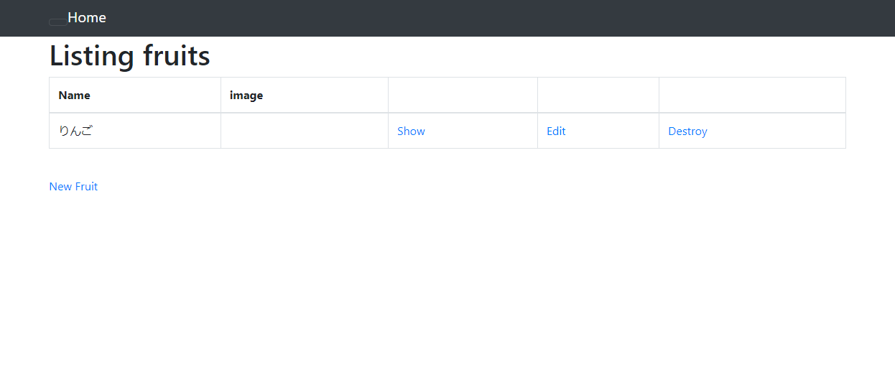
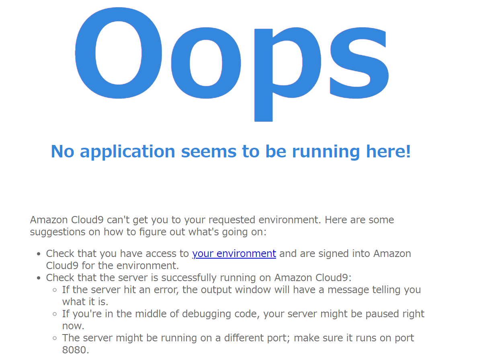
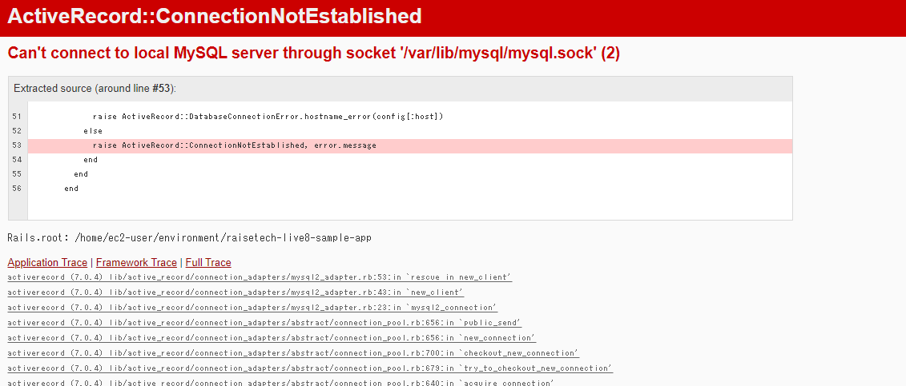

### サンプルアプリケーションを起動してみましょう。  

### APサーバーについて調べてみましょう。
アプリケーションを動かすためのサーバーのこと。
* APサーバーの名前：Puma
* バージョン：5.6.5
* サーバーを終了させた場合：接続できない  

### DBサーバーについて調べてみましょう。
システムが取り扱うデータを一元管理し、データの保存や更新、バックアップを行うためのもの。
* DBサーバーの名前：MySQL
* バージョン：8.0.32 for Linux on x86_64
* サーバーを終了させた場合：接続できない  

### Railsの構成管理ツールの名前は何でしたか？確認してみてください。
* ツール名：Bundler

### 今回の課題から学んだことを報告してください。
サーバーの導入からアプリケーションの起動までの流れを勉強しました。  
必要な工程が多かったので、定期的に復習して忘れないようにしたいと思います。  
  
[大まかな流れ]  
1. アプリケーションをcloneする
2. rvmを使い、rubyのバージョンを揃える
3. Gem、Bundlerのインストール
3. MySQLのインストール、パスワードの修正
4. アプリケーションとサーバーを紐づける
5. データベースの作成
6. yarnをインストール
7. 起動